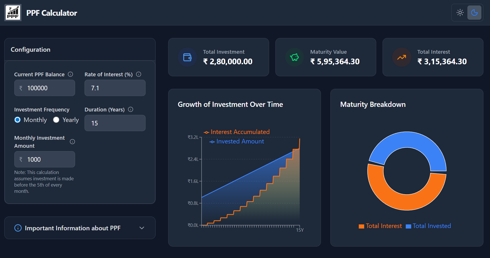
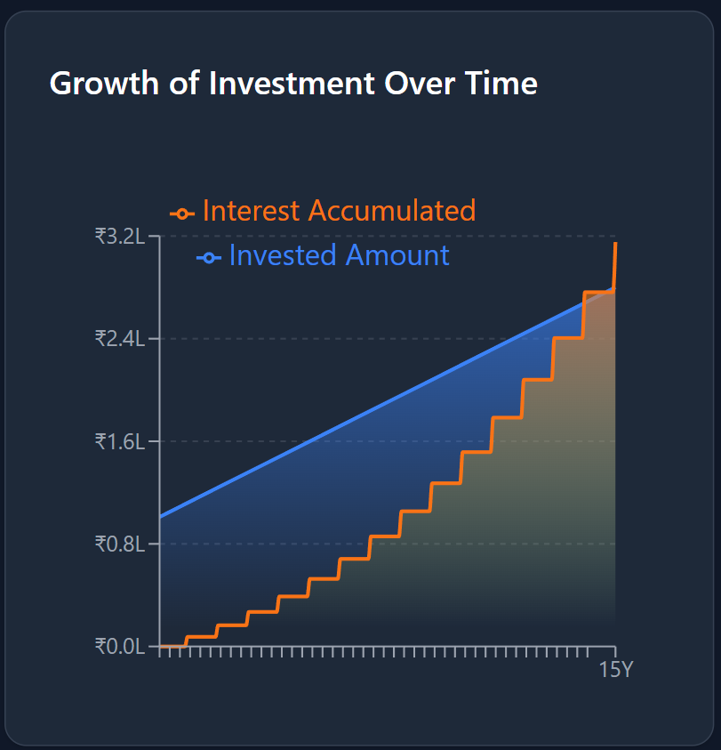
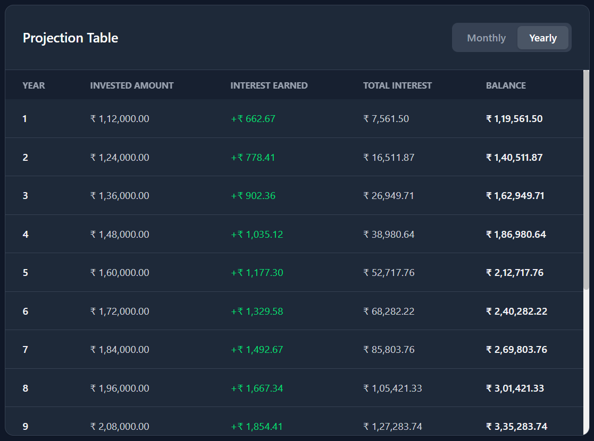
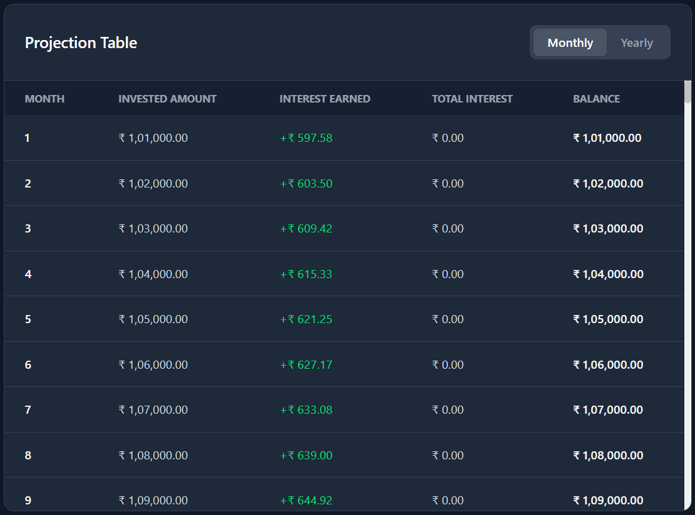

<h1>
  
  PPF Projection Calculator
</h1>
<br clear="left"/>

A modern, responsive web application designed to help users calculate and visualize their Public Provident Fund (PPF) investments over time. This tool provides detailed projections of interest accumulation and maturity values based on current interest rates.



🔗 **Live Demo:** [https://herdev-projects.web.app/](https://herdev-projects.web.app/)

## 🚀 Features

-   **Investment Projection:** Calculate maturity value based on annual investment, interest rate, and duration.
-   **Visual Charts:** Interactive Area and Pie charts to visualize "Total Invested" vs "Interest Earned".
-   **Detailed Breakdown:** Toggle between yearly and monthly views of your investment growth.
-   **Theme Support:** Fully supports Light and Dark modes with a custom toggle.
-   **Responsive Design:** Optimized for both desktop and mobile devices.

## 📈 Visualizing Compounding Growth

Experience the power of compounding visually. The interactive charts allow you to track how your money grows over the tenure.



> **The Power of Compounding:** The graph above shows the growth of your money with the invested amount (Blue) and the interest accumulated (Orange) over the years. Notice the point where the accumulated interest surpasses the invested amount—that effectively means you have earned more money through interest than what you have actually invested!

## 📊 Detailed Projections

Get a granular view of your investment with our detailed projection tables.

### Yearly Breakdown
A comprehensive year-by-year summary of your investment's progress.



### Monthly Breakdown
Drill down into the monthly details to see exactly how interest is calculated. The table highlights that interest is credited to your account on **March 31st** of every financial year.



## 🛠️ Tech Stack

This project is built using the following technologies:

-   **Frontend:** [React](https://react.dev/) (with TypeScript)
-   **Build Tool:** [Vite](https://vitejs.dev/)
-   **Styling:** [Tailwind CSS](https://tailwindcss.com/) (PostCSS)
-   **Visualization:** [Recharts](https://recharts.org/) (for interactive graphs)
-   **Icons:** [Lucide React](https://lucide.dev/)
-   **Deployment:** [Firebase Hosting](https://firebase.google.com/products/hosting)

## 💻 Installation & Local Setup

Follow these steps to run the project locally on your machine:

1.  **Clone the repository:**
    ```bash
    git clone https://github.com/AnisHerdev/ppf-projection-calculator-react.git
    cd ppf-projection-calculator-react
    ```

2.  **Install dependencies:**
    
    You can install all required packages using `npm install`, which reads from the `package.json` file.
    ```bash
    npm install
    ```
    
    Alternatively, if you want to install the main packages manually:
    ```bash
    npm install react react-dom lucide-react recharts react-is
    npm install -D tailwindcss postcss autoprefixer
    ```

3.  **Run the development server:**
    ```bash
    npm run dev
    ```

4.  **Open in Browser:**
    The application will be running at `http://localhost:5173` (or the port shown in your terminal).

## 📄 License

This project is open source and available for personal and educational use.
